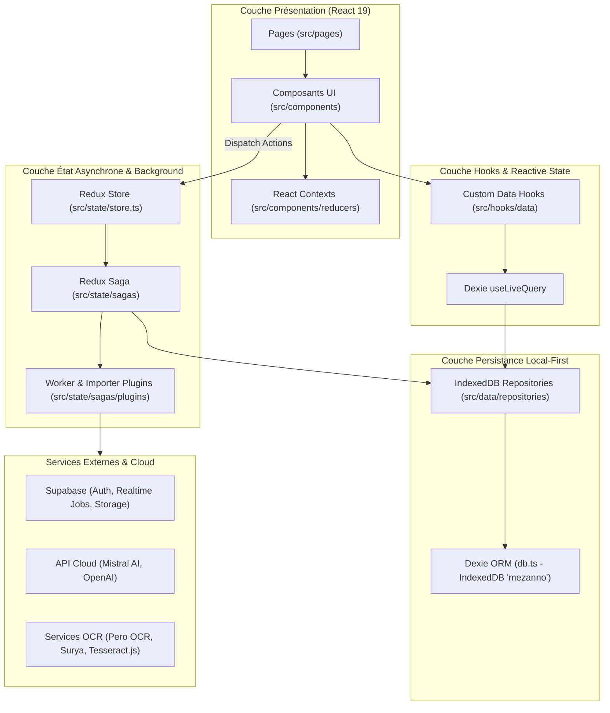

# Documentation Technique - CorpuSense

---

## 1. Vue d'ensemble

### Rôle du projet
**CorpuSense** est une application web *Local-First* d'ingénierie et d'analyse documentaire dédiée aux humanités numériques et à l'exploitation de corpus d'images patrimoniales. Elle permet aux chercheurs et développeurs d'importer des manifests [IIIF](https://iiif.io/) (International Image Interoperability Framework), d'organiser des collections de canvas, d'annoter des zones d'intérêt (ROI - Region of Interest), d'exécuter des traitements automatiques d'OCR, de détection de mise en page (*layout extraction*) ou de structuration de texte (via LLM ou modèles locaux), et d'exporter des données structurées.

### Principales fonctionnalités
1. **Importation IIIF et fichiers locaux** : Chargement de manifests via URL, identifiants ARK (ex: Gallica / BnF), JSON bruts ou téléversement de fichiers locaux (images, documents PDF).
2. **Exploration et visualisation interactive** : Visualiseur haute résolution basé sur [OpenSeaDragon](https://openseadragon.github.io/) et système d'annotation vectorielle interactif via [Annotorious 3](https://annotorious.github.io/).
3. **Gestion de collections et de projets** : Structuration dynamique des canvas IIIF en collections personnalisées.
4. **Moteur d'annotations W3C & Entités Nommées** : Création, catégorisation (classification / tagging) et édition d'annotations respectant le standard W3C Web Annotation Data Model.
5. **Orchestration de Workers et d'IA (OCR / LLM / Layout)** :
   - Exécution d'OCR locaux via [Tesseract.js](https://tesseract.projectnaptha.com/).
   - Traitements cloud/distribués via l'API [Mistral AI](https://mistral.ai/), [OpenAI](https://openai.com/), [Pero OCR](https://pero-ocr.fit.vutbr.cz/), ou l'écosystème Surya OCR/Layout.
   - Dispatch de tâches asynchrones distribuées via des workers Supabase Realtime (`cs_jobs`).
6. **Modélisation de données et chaînes de modificateurs** : Définition de schémas de données métier personnalisés et application de pipelines de transformation.
7. **Exportation** : Export des résultats aux formats CSV, JSON, Zip, ou annotations W3C/IIIF.

### Technologies principales
- **Interface & UI** : [React 19](https://react.dev/), [TypeScript 5.9](https://www.typescriptlang.org/), [Tailwind CSS 4](https://tailwindcss.com/), composants UI accessibles [Radix UI](https://www.radix-ui.com/) / [Shadcn UI](https://ui.shadcn.com/), [Lucide React](https://lucide.dev/).
- **Moteur de Build & Bundler** : [Vite 7](https://vitejs.dev/) avec extension PWA (`vite-plugin-pwa`).
- **Gestion de l'État & Logique Asynchrone** :
  - *Local-First State* : [Dexie.js v4](https://dexie.org/) (ORM IndexedDB) avec réactivité UI via `useLiveQuery` (`dexie-react-hooks`).
  - *Global Task/Event State* : [Redux Toolkit](https://redux-toolkit.js.org/) & [Redux Saga](https://redux-saga.js.org/).
  - *Server State & Caching* : [TanStack React Query v5](https://tanstack.com/query/latest).
  - *Local File System Handle Store* : [Zustand v5](https://zustand-demo.pmnd.rs/).
- **Protocoles & Visualisation Documents** : `@annotorious/react`, `@annotorious/openseadragon`, `openseadragon`, `@iiif/presentation-3`, `@iiif/parser`, `@hyzyla/pdfium`, `pdfjs-dist`.
- **Backend & Services Distribués** : [Supabase](https://supabase.com/) (Auth, Postgres Tables, Realtime Channels, Storage), Cantaloupe IIIF Server, EmailJS.
- **Tests & Qualité** : [Vitest](https://vitest.dev/), `@testing-library/react`, [ESLint 9](https://eslint.org/), [Prettier 3](https://prettier.io/).

### Résumé de l'architecture générale
CorpuSense repose sur une **architecture hybride Local-First**. Les données du domaine (manifests, collections, annotations, modèles, résultats) sont conservées directement dans la base IndexedDB du navigateur via l'ORM Dexie et lues de manière réactive par les composants React via des hooks personnalisés. Redux Toolkit et Redux Saga sont réservés à l'orchestration des tâches d'arrière-plan, à la gestion du statut des workers distants et à la propagation d'événements/notifications UI. Les appels réseau vers des services tiers (Supabase, LLM, OCR) sont encapsulés dans des modules de plugins chargés dynamiquement par Vite.

---

## 2. Démarrage rapide pour un nouveau développeur

### Prérequis
- **Node.js** : version `22.x` ou supérieure (conformément aux scripts de CI et `.github/workflows/gh-pages.yml`).
- **npm** : version `10.x` ou supérieure.

### 1. Installation du projet
Cloner le dépôt et installer les dépendances npm :
```bash
git clone https://github.com/mezanno/corpusense-dev.git
cd corpusense-dev
npm install
```

### 2. Configuration des variables d'environnement
Un fichier [.env](file:///home/jonathan/Documents/Workspaces/mezanno/corpusense-dev/.env) par défaut est présent à la racine du projet pour le développement. Vous pouvez créer un fichier `.env.development.local` pour surcharger la configuration locale.

Exemple de variables minimales requises dans `.env` :
```env
VITE_BASE_PATH=/
VITE_SUPABASE_URL=https://ilbjbghryyvjfdhgunhx.supabase.co
VITE_SUPABASE_ANON_KEY=eyJhbGciOiJIUzI1NiIsInR5cCI6IkpXVCJ9...
VITE_SUPABASE_STORAGE_URL=https://ilbjbghryyvjfdhgunhx.supabase.co/storage/v1/object/public/corpusense
VITE_CANTALOUPE_URL=https://iiif.mezanno.xyz/iiif/3/
```

### 3. Lancer l'application en développement
```bash
npm run dev
```
L'application démarre le serveur Vite (généralement accessible sur `http://localhost:5173`).

*(Facultatif)* Si vous testez des requêtes HTTP nécessitant le contournement des verrous CORS locaux :
```bash
node proxy.js
```
Le serveur proxy tourne sur `http://localhost:3001`.

### 4. Lancer les tests
- Exécuter la suite de tests Vitest une seule fois :
  ```bash
  npm run test
  ```
- Exécuter les tests en mode observation (*watch mode*) :
  ```bash
  npm run test:watch
  ```
- Générer le rapport de couverture de code :
  ```bash
  npm run test:coverage
  ```
- Ouvrir l'interface graphique Vitest UI :
  ```bash
  npm run ui
  ```

### 5. Lancer le lint et le formateur de code
- Vérification ESLint : `npm run lint` ou `npm run lint-src`
- Correction automatique ESLint : `npm run lint-fix` ou `npm run lint-src-fix`
- Vérification Prettier : `npm run format` ou `npm run format-src`
- Formatage automatique Prettier : `npm run format-fix` ou `npm run format-src-fix`

### 6. Effectuer un build de production
```bash
npm run build
```
Cette commande exécute séquentiellement :
1. `node scripts/generate-env.js` (génère `.env.production.local` contenant le commit short hash Git et l'horodatage du build).
2. `tsc -b` (vérification stricte des types TypeScript sur tous les projets de la solution).
3. `vite build` (bundle le code source dans le dossier `dist/`).

### 7. Prévisualiser le build de production
```bash
npm run preview
```
Permet de tester le comportement exact du bundle statique généré dans `dist/`.

---

## 3. Structure du projet

Arborescence des répertoires majeurs et leur rôle :

```text
corpusense-dev/
├── .github/
│   └── workflows/          # Workflows GitHub Actions (gh-pages.yml pour le déploiement continu)
├── public/                 # Assets statiques distribués tels quels (icônes, images)
│   ├── doc/                # Documentation technique et utilisateur originale (Markdown & schémas)
│   └── locales/            # Fichiers de traduction i18n (JSON)
├── scripts/                # Scripts Node.js exécutés pendant la chaîne de build (ex: generate-env.js)
├── src/
│   ├── __tests__/          # Fichiers de fixtures JSON, mocks d'environnement et utilitaires de test
│   ├── components/         # Composants React UI et composants d'interaction métier
│   │   ├── canvasViewer/   # Intégration d'OpenSeaDragon et d'Annotorious pour la vue canvas
│   │   ├── collectionPage/ # Composants d'inspection et de gestion des collections
│   │   ├── configuration/  # Onglets de configuration de l'application et saisie des clés API
│   │   ├── forms/          # Formulaires de saisie et de contact (ex: ContactForm via EmailJS)
│   │   ├── manifests/      # Composants de visualisation et de saisie des manifests IIIF
│   │   ├── models/         # Interfaces d'édition des schémas de données structurées
│   │   ├── reducers/       # React Context Providers (AlertDialog, Collection, ConnectedUser, Worker, etc.)
│   │   └── ui/             # Composants atomiques Shadcn UI / Radix UI (Button, Dialog, Tabs, etc.)
│   ├── data/               # Couche de données (Modèles métier, Repositories, Convertisseurs)
│   │   ├── models/         # Entités TypeScript, schémas Zod et DTOs (Annotation, Source, Collection, Worker, etc.)
│   │   └── repositories/   # Implémentation du pattern Repository sur IndexedDB avec Dexie.js
│   │       └── indexeddb/  # Schéma de base IndexedDB (db.ts), repositories et dbFactory.ts
│   ├── hooks/              # Custom Hooks React
│   │   ├── data/           # Hooks réactifs connectés aux Repositories Dexie (annotations, sources, collections...)
│   │   └── ui/             # Hooks utilitaires d'interface utilisateur (responsive, mobile...)
│   ├── lib/                # Fonctions utilitaires UI génériques (ex: utilitaire clsx / tailwind-merge dans utils.ts)
│   ├── pages/              # Composants React représentants les pages/vues principales de l'application
│   ├── state/              # Gestion d'état centralisée Redux Toolkit & Redux Saga
│   │   ├── reducers/       # Slices Redux (workers, events)
│   │   ├── sagas/          # Logique asynchrone Saga et chargeurs de plugins (workers, importers)
│   │   │   └── plugins/    # Plugins d'importation IIIF et plugins de traitement worker (OCR, LLM, Surya, Pero)
│   │   ├── selectors/      # Sélecteurs Redux mémoïsés
│   │   └── zustand/        # Stores Zustand (ex: useFSHandleStore)
│   ├── types/              # Déclarations globales de types TypeScript (.d.ts)
│   ├── utils/              # Clients d'API externes (Supabase, helpers d'images, helpers de manifest)
│   ├── App.tsx             # Composant racine, configuration du Router et empilement des Providers
│   ├── i18n.ts             # Initialisation du système d'internationalisation (i18next)
│   ├── main.tsx            # Point d'entrée de l'application React (bootstrap Vite)
│   └── vite-env.d.ts       # Déclarations de types des variables d'environnement Vite
├── index.html              # Fichier HTML racine
├── package.json            # Dépendances npm et définition des scripts de commande
├── proxy.js                # Serveur proxy Express local optionnel pour les tests CORS
└── vite.config.ts          # Configuration du serveur de dev, du bundler Vite, de Vitest et de la PWA
```

---

## 4. Architecture applicative

CorpuSense suit un découpage strict en couches, assurant le découplage entre l'UI, la persistance locale et l'exécution asynchrone :



### Rôles et responsabilités des couches :
1. **Bootstrap (`src/main.tsx` & `src/App.tsx`)** : Point d'entrée React. Il charge les plugins Sagas de manière impérative (`loadWorkerPlugins()`, `loadImporterPlugins()`), instancie le client TanStack Query et configure la pile de Context Providers enveloppant le routeur (`BrowserRouter`).
2. **Navigation & Vues (`src/pages/` & `src/hooks/useAppNavigation.tsx`)** : Le routeur associe des composants de pages aux chemins configurés dans `CorpusenseRoutes`. Le layout principal `Layout.tsx` fournit la barre latérale `LayoutSidebar.tsx` et le panneau de contenu principal.
3. **Mise à jour réactive Local-First (`src/hooks/data/`)** : Les composants s'abonnent directement à la base IndexedDB locale via des hooks personnalisés (`useLiveSources`, `useLiveCollections`, etc.) qui s'appuient sur `useLiveQuery` de Dexie. Tout changement dans la base rafraîchit automatiquement l'interface utilisateur.
4. **Logique asynchrone & Workers (`src/state/sagas/`)** : Lors du lancement d'un traitement lourd (OCR, LLM, analyse de mise en page), l'UI émet une action Redux (`startWorkerRequest`). La Saga correspondante intercepte l'action, instancie le plugin approprié (`src/state/sagas/plugins/workers/`), effectue les requêtes externes ou le calcul local, puis sauvegarde les résultats produits (`Result.ts`) dans les Repositories IndexedDB avant d'émettre un signal de succès vers Redux.

---

## 5. Flux d'exécution

### 1. Au démarrage (Bootstrap)
1. Le navigateur charge [index.html](file:///home/jonathan/Documents/Workspaces/mezanno/corpusense-dev/index.html) qui exécute [src/main.tsx](file:///home/jonathan/Documents/Workspaces/mezanno/corpusense-dev/src/main.tsx).
2. `main.tsx` importe [src/i18n.ts](file:///home/jonathan/Documents/Workspaces/mezanno/corpusense-dev/src/i18n.ts) pour démarrer l'internationalisation i18next et englobe l'application dans le composant `<Provider store={store}>` de Redux.
3. [src/App.tsx](file:///home/jonathan/Documents/Workspaces/mezanno/corpusense-dev/src/App.tsx) appelle `initI18n()`. À la résolution de la promesse, il charge dynamiquement les plugins via Vite `import.meta.glob` (`loadWorkerPlugins()` et `loadImporterPlugins()`).
4. `<App />` initialise `<BrowserRouter basename={basePath}>` et la chaîne des React Context Providers (`QueryClientProvider`, `ExperimentalProvider`, `ConnectedUserProvider`, `CollectionProvider`, `WorkerProvider`, `TooltipProvider`, `AlertDialogProvider`).
5. Le composant [Layout.tsx](file:///home/jonathan/Documents/Workspaces/mezanno/corpusense-dev/src/pages/Layout.tsx) est monté, affichant la barre de navigation latérale et effectuant le rendu de la page d'accueil [Home.tsx](file:///home/jonathan/Documents/Workspaces/mezanno/corpusense-dev/src/pages/Home.tsx).

### 2. Lors d'une navigation
1. L'utilisateur clique sur un élément de navigation dans [LayoutSidebar.tsx](file:///home/jonathan/Documents/Workspaces/mezanno/corpusense-dev/src/pages/LayoutSidebar.tsx) ou une action déclenche le hook [useAppNavigation.tsx](file:///home/jonathan/Documents/Workspaces/mezanno/corpusense-dev/src/hooks/useAppNavigation.tsx).
2. Le hook appelle une méthode de navigation (ex: `goToCollectionInspector(collectionId)`), qui exécute `navigate('/collections/123')`.
3. `React Router DOM` intercepte le changement d'URL et rend le composant [CollectionInspectorPage.tsx](file:///home/jonathan/Documents/Workspaces/mezanno/corpusense-dev/src/pages/CollectionInspectorPage.tsx) dans l'élément `<Outlet />` de `Layout.tsx`.

### 3. Lors d'une action utilisateur (Exemple : Lancement d'une tâche d'OCR)

```text
Utilisateur (Clic sur "Lancer Worker OCR")
→ CollectionInspectorContent.tsx (IHM)
→ Action Redux dispatchée : appDispatch(startWorkerRequest({ workerId, task }))
→ Middleware Redux-Saga intercepte l'action (src/state/sagas/workers.ts)
→ Sélection du plugin de worker correspondant (ex: mistralOcr.ts / tesseract.ts)
→ Appel du Service Externe / Exécution de la tâche (API HTTP Mistral ou Web Worker Tesseract)
→ Réception du résultat (WorkerResponse & Result)
→ Sauvegarde dans IndexedDB via IndexedDBResultRepository (src/data/repositories/indexeddb/results.ts)
→ Émission d'un 'put' Redux pour mettre à jour le statut du worker (workersReducer) et déclencher un Toast (eventsReducer)
→ Notification Dexie 'useLiveQuery' déclenchée automatiquement
→ Re-rendu réactif des composants affichant les résultats ou annotations
```

---

## 6. Gestion de l'état

CorpuSense utilise cinq mécanismes distincts pour gérer l'état, chacun ayant un rôle architectural précis :

| Mécanisme d'état | Emplacement du code | Contenu / Rôle | Mode de consommation |
| :--- | :--- | :--- | :--- |
| **IndexedDB State (Dexie)** | [db.ts](file:///home/jonathan/Documents/Workspaces/mezanno/corpusense-dev/src/data/repositories/indexeddb/db.ts) | **Données métier persistantes** : Manifests, Collections, Canvas, Annotations, Entités Nommées, Modèles de données, Résultats d'OCR, Sources local/remote. | Réactif dans les composants React grâce à `useLiveQuery` (hooks sous `src/hooks/data/`). |
| **Redux Toolkit Store** | [store.ts](file:///home/jonathan/Documents/Workspaces/mezanno/corpusense-dev/src/state/store.ts) | **État d'exécution global & Événements UI** : Statut dynamique des workers en cours (`workersReducer`) et file des notifications Toast (`eventsReducer`). | Consommé via `useAppSelector` et modifié via `useAppDispatch` avec Redux-Saga. |
| **React Contexts** | [src/components/reducers/](file:///home/jonathan/Documents/Workspaces/mezanno/corpusense-dev/src/components/reducers) | **États de session & contextes locaux** : Session utilisateur Supabase (`ConnectedUserContext`), sélection courante de canvas (`CanvasSelectionContext`), mode d'édition d'annotations (`AnnotationContext`), état de la page manifest (`ManifestPageContext`). | Consommé via des hooks personnalisés dédiés (ex: `useConnectedUserContext()`, `useCollectionContext()`). |
| **Zustand Store** | [useFSHandleStore.ts](file:///home/jonathan/Documents/Workspaces/mezanno/corpusense-dev/src/state/zustand/useFSHandleStore.ts) | **Descripteurs de fichiers système** : Maintient en mémoire volatile les `FileSystemFileHandle` issus de l'API Web File System Access. | Accédé via le hook Zustand `useFSHandleStore()`. |
| **localStorage** | Navigateur | **Configuration & Clés API** : Clés d'API personnalisées (Mistral, OpenAI), drapeaux de fonctionnalités expérimentales (`experimental_features`). | Lu au besoin par les plugins et la page de configuration (`ConfigurationAPITab.tsx`). |

---

## 7. Composants React

Seuls les composants les plus structurants de l'application sont listés ci-dessous :

### Vue & Navigation Principale
- **`Layout`** ([src/pages/Layout.tsx](file:///home/jonathan/Documents/Workspaces/mezanno/corpusense-dev/src/pages/Layout.tsx)) : Structure globale de l'application. Contient la barre latérale de navigation `LayoutSidebar` et la zone d'affichage des routes (`Outlet`).
- **`LayoutSidebar`** ([src/pages/LayoutSidebar.tsx](file:///home/jonathan/Documents/Workspaces/mezanno/corpusense-dev/src/pages/LayoutSidebar.tsx)) : Menu principal de navigation latérale. Gère les liens vers les différentes sections (Manifests, Collections, Modèles, Storage, Workers, Config).

### Visualisation & Annotation IIIF
- **`CanvasViewerOSD`** ([src/components/canvasViewer/CanvasViewerOSD.tsx](file:///home/jonathan/Documents/Workspaces/mezanno/corpusense-dev/src/components/canvasViewer/CanvasViewerOSD.tsx)) : Composant conteneur initialisant le visualiseur d'image OpenSeaDragon et synchronisant les dimensions du canvas.
- **`CanvasViewerOSDContent`** ([src/components/canvasViewer/CanvasViewerOSDContent.tsx](file:///home/jonathan/Documents/Workspaces/mezanno/corpusense-dev/src/components/canvasViewer/CanvasViewerOSDContent.tsx)) : Composant d'annotation. Il instancie `@annotorious/openseadragon`, écoute les événements de création/modification de formes géométriques et convertit les événements utilisateur en objets `Annotation` persistant dans IndexedDB.
- **`CanvasGallery`** ([src/components/CanvasGallery.tsx](file:///home/jonathan/Documents/Workspaces/mezanno/corpusense-dev/src/components/CanvasGallery.tsx)) : Grille virtuelle réutilisable affichant les cartes de canvas (`CanvasCard`) avec sélection multiple.

### Inspection & Traitement
- **`CollectionInspectorContent`** ([src/components/CollectionInspectorContent.tsx](file:///home/jonathan/Documents/Workspaces/mezanno/corpusense-dev/src/components/CollectionInspectorContent.tsx)) : Vue centrale d'inspection d'une collection. Organise la barre d'outils, la vue canvas, la liste des annotations et le panneau d'exécution des workers.

---

## 8. Hooks

Les hooks personnalisés importants du projet sont répartis par domaine :

### Hooks de Données Reactifs (IndexedDB / Repositories)
- **`useLiveSources`** ([src/hooks/data/sources/useLiveSources.tsx](file:///home/jonathan/Documents/Workspaces/mezanno/corpusense-dev/src/hooks/data/sources/useLiveSources.tsx)) :
  - *Rôle* : S'abonne en temps réel aux sources d'images locales et distantes enregistrées dans IndexedDB.
  - *Retour* : `{ remoteSources, localSources, sourcesCount, removeUnusedSources }`.
- **`useLiveCollections`** ([src/hooks/data/collections/useLiveCollections.tsx](file:///home/jonathan/Documents/Workspaces/mezanno/corpusense-dev/src/hooks/data/collections/useLiveCollections.tsx)) :
  - *Rôle* : Fournit la liste réactive de toutes les collections et permet leur création ou suppression.
- **`useAnnotationsForCanvas`** ([src/hooks/data/annotations/useAnnotationsForCanvas.ts](file:///home/jonathan/Documents/Workspaces/mezanno/corpusense-dev/src/hooks/data/annotations/useAnnotationsForCanvas.ts)) :
  - *Rôle* : Récupère et s'abonne aux annotations rattachées à un `canvasId` et une `collectionId` spécifiques.

### Hooks Système & Services
- **`useJobRealtime`** ([src/hooks/useJobRealtime.tsx](file:///home/jonathan/Documents/Workspaces/mezanno/corpusense-dev/src/hooks/useJobRealtime.tsx)) :
  - *Rôle* : Synchronise les tâches d'arrière-plan exécutées sur Supabase Realtime (écoute des canaux de la table `cs_jobs` avec repli sur un mécanisme de polling).
- **`usePdfConverter`** ([src/hooks/usePdfConverter.ts](file:///home/jonathan/Documents/Workspaces/mezanno/corpusense-dev/src/hooks/usePdfConverter.ts)) :
  - *Rôle* : Gère le rendu et la conversion des fichiers PDF téléversés en images/canvas IIIF réutilisables en s'appuyant sur `@hyzyla/pdfium` et `pdfjs-dist`.
- **`useAppNavigation`** ([src/hooks/useAppNavigation.tsx](file:///home/jonathan/Documents/Workspaces/mezanno/corpusense-dev/src/hooks/useAppNavigation.tsx)) :
  - *Rôle* : Encapsule les redirections de l'application à travers des fonctions typées (`goToManifestExplorer`, `goToCollectionInspector`, etc.).

---

## 9. Communication avec les APIs et services externes

CorpuSense interagit avec plusieurs services distants ou processeurs spécialisés :

### 1. Backend Supabase (`src/utils/config.ts` & `src/utils/supabase.ts`)
- **Authentification** : Gestion des sessions utilisateurs (`supabase.auth`).
- **Base de données distribuée & Jobs** : La table `cs_jobs` est utilisée pour distribuer des tâches d'OCR ou de traitement complexe vers des nœuds workers externes. Le hook `useJobRealtime` s'abonne aux modifications en temps réel via des web sockets Supabase.
- **Storage** : Stockage public d'images et de manifests téléversés (`corpusense` storage bucket).

### 2. Plugins de Workers OCR / IA (`src/state/sagas/plugins/workers/`)
- **Mistral AI (`mistral.ts`, `mistralOcr.ts`)** : Utilise le SDK officiel `@mistralai/mistralai` pour la structuration de données et la reconnaissance de texte sur des images transmises en base64/URL.
- **OpenAI (`openai.ts`)** : Envoie des requêtes d'analyse visuelle ou textuelle à l'API OpenAI.
- **Tesseract.js (`tesseract.ts`)** : Moteur OCR JavaScript local s'exécutant dans un Web Worker du navigateur.
- **Pero OCR (`peroocr.ts`) & Surya (`suryaOcr.ts`, `suryaLayout.ts`, `suryaTable.ts`)** : Appels vers des microservices distants d'OCR et d'analyse de mise en page.

### 3. Importers IIIF (`src/state/sagas/plugins/importers/`)
- **Gallica (`gallica.ts`)** : Convertit un identifiant ARK Gallica (BnF) en URL de manifest IIIF valide et télécharge ses métadonnées.
- **Default Importer (`default.ts`)** : Récupère les manifests JSON-LD IIIF v2/v3 à partir de n'importe quelle URL HTTP(S) distante.

### 4. Formulaire de contact (`ContactForm.tsx`)
- Intégration directe de la bibliothèque `@emailjs/browser` pour l'envoi de messages de support/retours d'expérience sans serveur backend dédié.

---

## 10. Modèle de données et types

Les modèles fondamentaux sont situés dans le dossier [src/data/models/](file:///home/jonathan/Documents/Workspaces/mezanno/corpusense-dev/src/data/models/).

### Entités principales
- **`Annotation`** ([Annotation.ts](file:///home/jonathan/Documents/Workspaces/mezanno/corpusense-dev/src/data/models/Annotation.ts)) :
  Formât d'annotation hybride basé sur la spécification `@annotorious/annotorious` (`ImageAnnotation`) enrichi avec un schéma Zod (`AnnotationSchema`).
  - Propriétés principales : `id`, `canvasId`, `collectionId`, `order`, `type` (`ElementType` : `TEXT_LINE`, `TEXT_REGION`, `UNKNOWN`), `target` (géométrie du rectangle), et `bodies` (W3C Motivations : `classifying` pour le type, `tagging` pour la valeur texte).
- **`Source`** ([Sources.ts](file:///home/jonathan/Documents/Workspaces/mezanno/corpusense-dev/src/data/models/Sources.ts)) :
  Représente un document ou manifest importé. Peut être de type `'remote'` (manifest IIIF distant) ou `'local'` (images/PDF téléversés localement).
- **`Collection` & `CollectionElement`** ([Collection.ts](file:///home/jonathan/Documents/Workspaces/mezanno/corpusense-dev/src/data/models/Collection.ts)) :
  Permettent de regrouper arbitrairement des canvas issus de multiples sources sous un identifiant unique.
- **`Worker` & `Task`** ([Worker.ts](file:///home/jonathan/Documents/Workspaces/mezanno/corpusense-dev/src/data/models/Worker.ts)) :
  Définition des paramètres de configuration et des tâches exécutées par les plugins de traitement.
- **`Result`** ([Result.ts](file:///home/jonathan/Documents/Workspaces/mezanno/corpusense-dev/src/data/models/Result.ts)) :
  Conteneur de sortie stockant les données extraites par un worker pour un canvas donné.

---

## 11. Persistance et stockage local

La persistance locale s'appuie sur la base IndexedDB nommée `'mezanno'` gérée par Dexie v4 dans [src/data/repositories/indexeddb/db.ts](file:///home/jonathan/Documents/Workspaces/mezanno/corpusense-dev/src/data/repositories/indexeddb/db.ts).

### Tables IndexedDB et leurs index (Version 30) :
- `collections` : `&id, name, *tags.id`
- `collectionContents` : `&id`
- `storedManifests` : `&id, name`
- `storedManifestContents` : `&id`
- `annotations` : `&id, canvasId, collectionId, [canvasId+collectionId], order, [canvasId+collectionId+type], [collectionId+type]`
- `annotationsTemp` : `&id, canvasId, collectionId, [canvasId+collectionId], order, [canvasId+collectionId+type]`
- `models` : `&id, name`
- `namedEntities` : `&id, *annotationIds, type.id`
- `results` : `++id, workerName, workerId, [scopeKey+workerName], taskId, [workerId+taskId]`
- `workers` : `&id, name, status, [scopeKey+name]`
- `sources` : `&id, name, type`
- `sourceContents` : `&id`
- `storedBlobs` : `&id`

### Repositories et Factory
L'accès aux données IndexedDB ne se fait jamais directement depuis les composants React. Il passe obligatoirement par des repositories (ex: `IndexedDBAnnotationRepository`) instanciés au travers de la factory [dbFactory.ts](file:///home/jonathan/Documents/Workspaces/mezanno/corpusense-dev/src/data/repositories/indexeddb/dbFactory.ts).

---

## 12. Routing et navigation

Les routes de l'application sont centralisées dans la constante `CorpusenseRoutes` du fichier [useAppNavigation.tsx](file:///home/jonathan/Documents/Workspaces/mezanno/corpusense-dev/src/hooks/useAppNavigation.tsx) et déclarées dans [App.tsx](file:///home/jonathan/Documents/Workspaces/mezanno/corpusense-dev/src/App.tsx) :

| Chemin de la route | Constante | Composant de Page | Description |
| :--- | :--- | :--- | :--- |
| `/` | `index` | `Home` | Page d'accueil et d'introduction. |
| `/manifest` | `CorpusenseRoutes.MANIFEST` | `ManifestExplorerPage` | Visualiseur et explorateur de manifests IIIF. |
| `/collections` | `CorpusenseRoutes.COLLECTIONS` | `CollectionsManagerPage` | Liste et gestionnaire des collections. |
| `/collections/:collectionId` | Dynamic | `CollectionInspectorPage` | Inspection, annotation et traitements sur une collection. |
| `/models` | `CorpusenseRoutes.MODELS` | `ModelsManagerPage` | Éditeur de modèles de données structurées. |
| `/modifier-chain` | `CorpusenseRoutes.MODIFIERCHAIN` | `ModifierChainManagerPage` | Gestionnaire des chaînes de modificateurs. |
| `/localSources` | `CorpusenseRoutes.LOCAL_SOURCES` | `StoragePage` | Gestion du stockage local et des fichiers importés. |
| `/workers` | `CorpusenseRoutes.WORKERS` | `WorkersManagerPage` | Panneau de suivi et configuration des workers. |
| `/configuration` | `CorpusenseRoutes.CONFIGURATION` | `ConfigurationPage` | Saisie des clés API et préférences applicatives. |
| `/doc` & `/doc/:page` | `CorpusenseRoutes.DOCUMENTATION` | `DocumentationPage` | Visualiseur de documentation Markdown intégrée. |

### Comment ajouter une nouvelle route :
1. Déclarer la clé de route dans l'objet `CorpusenseRoutes` dans [useAppNavigation.tsx](file:///home/jonathan/Documents/Workspaces/mezanno/corpusense-dev/src/hooks/useAppNavigation.tsx).
2. Ajouter la fonction helper correspondante dans `useAppNavigation()` (ex: `goToMyNewPage`).
3. Créer le composant de page sous `src/pages/MyNewPage.tsx`.
4. Déclarer la balise `<Route path={CorpusenseRoutes.MY_NEW_PAGE} element={<MyNewPage />} />` dans [App.tsx](file:///home/jonathan/Documents/Workspaces/mezanno/corpusense-dev/src/App.tsx) à l'intérieur du bloc `<Route element={<Layout />}>`.

---

## 13. Configuration et variables d'environnement

Les variables d'environnement sont lues via `import.meta.env` dans [src/utils/config.ts](file:///home/jonathan/Documents/Workspaces/mezanno/corpusense-dev/src/utils/config.ts) et [vite.config.ts](file:///home/jonathan/Documents/Workspaces/mezanno/corpusense-dev/vite.config.ts).

| Variable | Rôle | Obligatoire | Utilisée par |
| :--- | :--- | :---: | :--- |
| `VITE_BASE_PATH` | Chemin racine d'hébergement sous-répertoire (ex: `/corpusense-dev/`). | Non (Défaut: `/`) | `App.tsx`, `vite.config.ts`, Router, PWA |
| `VITE_SUPABASE_URL` | URL de l'instance du projet Supabase. | Oui | `src/utils/config.ts` |
| `VITE_SUPABASE_ANON_KEY` | Clé d'API publique anonyme Supabase. | Oui | `src/utils/config.ts` |
| `VITE_SUPABASE_STORAGE_URL` | URL du bucket de stockage d'objets Supabase. | Oui | `src/utils/manifest.ts` |
| `VITE_CANTALOUPE_URL` | URL de base du serveur d'images IIIF Cantaloupe. | Optionnel | `StoragePage.tsx` |
| `VITE_EMAILJS_PUBLIC_KEY` | Clé publique pour l'envoi de mails via EmailJS. | Optionnel | `ContactForm.tsx` |
| `VITE_EMAILJS_SERVICE_ID` | Service ID du template EmailJS. | Optionnel | `ContactForm.tsx` |
| `VITE_EMAILJS_TEMPLATE_ID` | Template ID du formulaire de contact EmailJS. | Optionnel | `ContactForm.tsx` |
| `VITE_APP_VERSION` | Version courante de l'application (extraite de `package.json`). | Injecté | `VersionDisplay.tsx` |
| `VITE_BUILD_DATE` | Date et heure de génération du build. | Injecté (build) | `VersionDisplay.tsx` |
| `VITE_GIT_HASH` | Commit short hash Git du build. | Injecté (build) | `VersionDisplay.tsx` |

> [!CAUTION]
> Aucune clé API secrète (ex: clé secrète Supabase, clé privée Mistral ou OpenAI) ne doit être inscrite dans les fichiers `.env` commités. Les clés utilisateur sont saisies directement par l'utilisateur final dans la page de configuration et conservées dans son `localStorage` local.

---

## 14. Tests

### Organisation et Framework
- **Framework** : Vitest avec l'environnement de simulation DOM `jsdom`.
- **Conventions de localisation** : Les tests unitaires et d'intégration sont placés dans des sous-dossiers nommés `__tests__/` situés directement à côté des fichiers à tester.
  - Exemples :
    - [src/pages/__tests__/CollectionInspectorPage.test.tsx](file:///home/jonathan/Documents/Workspaces/mezanno/corpusense-dev/src/pages/__tests__/CollectionInspectorPage.test.tsx)
    - [src/components/__tests__/CanvasCard.test.tsx](file:///home/jonathan/Documents/Workspaces/mezanno/corpusense-dev/src/components/__tests__/CanvasCard.test.tsx)
    - [src/data/models/__tests__/Annotation.test.ts](file:///home/jonathan/Documents/Workspaces/mezanno/corpusense-dev/src/data/models/__tests__/Annotation.test.ts)
    - [src/data/utils/__tests__/export.test.ts](file:///home/jonathan/Documents/Workspaces/mezanno/corpusense-dev/src/data/utils/__tests__/export.test.ts)
- **Fichier de configuration global** : [vitest.setup.ts](file:///home/jonathan/Documents/Workspaces/mezanno/corpusense-dev/vitest.setup.ts) configure `@testing-library/jest-dom`, mock les fonctions Canvas WebGL et i18next.

### Lancer un test spécifique
Pour exécuter un test ou un fichier de test en particulier, passez son nom ou son chemin à la commande Vitest :
```bash
npx vitest src/pages/__tests__/CollectionInspectorPage.test.tsx
```

---

## 15. Build, déploiement et CI/CD

### Flux de Build et Déploiement

```text
Code Source (Branche develop)
→ Commande npm run build (generate-env.js -> tsc -b -> vite build)
→ Génération du répertoire dist/ (SPA HTML/JS/CSS statiques)
→ GitHub Actions (.github/workflows/gh-pages.yml)
→ Déploiement automatique sur la branche gh-pages (GitHub Pages)
```

### Intégration Continue (GitHub Actions)
Le fichier [.github/workflows/gh-pages.yml](file:///home/jonathan/Documents/Workspaces/mezanno/corpusense-dev/.github/workflows/gh-pages.yml) automatise le déploiement :
1. Déclenchement automatique lors de tout `push` sur la branche `develop`.
2. Configuration de Node.js `22.x` avec cache npm.
3. Exécution des commandes `npm install` et `npm run build`.
4. Publication automatique du dossier `dist/` sur la branche `gh-pages` de GitHub Pages.

---

## 16. Dépendances importantes

| Dépendance | Rôle architectural | Remarques |
| :--- | :--- | :--- |
| **`@annotorious/react` & `@annotorious/openseadragon`** | Moteur d'annotation vectorielle et visualiseur haute définition IIIF. | Essentiel pour la saisie et le rendu des polygones/rectangles d'annotation sur les canvas. |
| **`dexie` & `dexie-react-hooks`** | ORM pour IndexedDB. Fournit le hook `useLiveQuery`. | Cœur de l'architecture Local-First pour la persistance locale et la réactivité UI sans rechargement. |
| **`@reduxjs/toolkit` & `redux-saga`** | Store d'état global et moteur de gestion des effets de bord asynchrones. | Orchestre les traitements workers complexes, le suivi d'exécution et les notifications toast. |
| **`@iiif/presentation-3` & `@iiif/parser`** | Normalisation et manipulation des structures de manifests IIIF v3. | Assure la conformité aux standards internationaux IIIF. |
| **`@mistralai/mistralai`** | SDK client officiel Mistral AI. | Permet la communication directe avec les modèles LLM Mistral pour l'OCR et la structuration. |
| **`@supabase/supabase-js`** | SDK client Supabase. | Assure la gestion des utilisateurs, la communication Realtime pour les jobs distribués et le stockage cloud. |
| **`@hyzyla/pdfium` & `pdfjs-dist`** | Moteurs de rendu et de conversion PDF en WebAssembly/JS. | Permettent l'importation directe de fichiers PDF locaux et leur découpage en images. |

---

## 17. Conventions et patterns du projet

1. **Pattern Repository & Factory** :
   Toute interaction avec IndexedDB doit passer par la factory `dbFactory.ts` (ex: `getAnnotationRepository()`). Ne jamais faire d'appel direct aux méthodes de `db` Dexie dans les composants UI.
2. **Chargement de Plugins par Découverte Dynamique** :
   Les workers et importers sont des modules autonomes placés dans `src/state/sagas/plugins/workers/` et `importers/`. Ils sont découverts au runtime par Vite grâce à `import.meta.glob`.
3. **Typage et Validation Stricte via Zod** :
   Les modèles de données complexes possèdent un schéma Zod associé (ex: `AnnotationSchema` dans `Annotation.ts`) permettant la validation et la déduction dynamique de types TypeScript via `z.infer`.
4. **Alias d'importation `@`** :
   Tous les imports internes du dossier `src/` doivent impérativement utiliser le préfixe d'alias `@/` (ex: `import { Source } from '@/data/models/Sources'`).
5. **Co-localisation des tests unitaires** :
   Tout nouveau composant, service ou utilitaire doit être accompagné de ses tests unitaires placés dans un dossier `__tests__/` contigu au fichier source.

---

## 18. Guide : ajouter une fonctionnalité

### Exemple : Ajouter un nouveau modèle métier (ex: "ProjectNotes")

#### Étape 1 : Définir le modèle et le schéma Zod
Créer le fichier [src/data/models/ProjectNote.ts](file:///home/jonathan/Documents/Workspaces/mezanno/corpusense-dev/src/data/models/ProjectNote.ts) :
```typescript
import { z } from 'zod';

export const ProjectNoteSchema = z.object({
  id: z.string(),
  projectId: z.string(),
  content: z.string(),
  createdAt: z.string(),
});

export type ProjectNote = z.infer<typeof ProjectNoteSchema>;
```

#### Étape 2 : Mettre à jour le schéma IndexedDB
Dans [src/data/repositories/indexeddb/db.ts](file:///home/jonathan/Documents/Workspaces/mezanno/corpusense-dev/src/data/repositories/indexeddb/db.ts), ajouter la table au typage Dexie et déclarer la clé primaire dans `.stores()` :
```typescript
// Ajouter la table au type de db
projectNotes: EntityTable<ProjectNote, 'id'>;

// Dans db.version(XX).stores({...})
projectNotes: '&id, projectId, createdAt'
```

#### Étape 3 : Créer le Repository
Créer le fichier `src/data/repositories/indexeddb/projectNotes.ts` et ajouter le getter correspondant dans [dbFactory.ts](file:///home/jonathan/Documents/Workspaces/mezanno/corpusense-dev/src/data/repositories/indexeddb/dbFactory.ts).

#### Étape 4 : Créer le Hook réactif
Créer le hook `src/hooks/data/useProjectNotes.ts` utilisant `useLiveQuery` :
```typescript
import { useLiveQuery } from 'dexie-react-hooks';
import { getProjectNotesRepository } from '@/data/repositories/indexeddb/dbFactory';

export const useProjectNotes = (projectId: string) => {
  const repo = getProjectNotesRepository();
  const notes = useLiveQuery(() => repo.getByProjectId(projectId), [projectId], []);
  return { notes };
};
```

#### Étape 5 : Créer la vue UI et la Route
1. Créer le composant de page sous `src/pages/ProjectNotesPage.tsx`.
2. Déclarer la route dans [useAppNavigation.tsx](file:///home/jonathan/Documents/Workspaces/mezanno/corpusense-dev/src/hooks/useAppNavigation.tsx) et [App.tsx](file:///home/jonathan/Documents/Workspaces/mezanno/corpusense-dev/src/App.tsx).
3. Ajouter un test unitaire dans `src/pages/__tests__/ProjectNotesPage.test.tsx`.

---

## 19. Guide : modifier une fonctionnalité existante

### Méthode de Navigation Conseillée pour un Développeur :
```text
Nom de la Fonctionnalité (ex: "Édition des Annotations sur un Canvas")
↓
1. Identifier la Route : CorpusenseRoutes.COLLECTIONS (src/hooks/useAppNavigation.tsx)
↓
2. Retrouver la Page : src/pages/CollectionInspectorPage.tsx
↓
3. Consulter le Composant d'Interface : src/components/CollectionInspectorContent.tsx & CanvasViewerOSDContent.tsx
↓
4. Identifier le Hook de Données : src/hooks/data/annotations/useAnnotationsForCanvas.ts
↓
5. Inspecter le Repository et la DB : src/data/repositories/indexeddb/annotations.ts & db.ts
↓
6. Modifier la Logique du Modèle : src/data/models/Annotation.ts
```

---

## 20. Points d'attention et pièges fréquents

1. **Migrations IndexedDB partielles / manuelles** :
   Lorsqu'une mise à jour majeure de schéma survient dans `db.ts` (ex: passage des manifests vers l'entité `Source`), la migration automatique dans Dexie `.upgrade()` peut être désactivée au profit d'un déclenchement manuel par l'utilisateur depuis l'UI (`IndexedDBSourceRepository.migrateAllSources()`). Soyez attentif à la compatibilité des anciennes données lors des modifications de schéma.
2. **Mocking d'i18next dans les tests** :
   Vitest substitue `react-i18next` et `i18next` par des modules de test dédiés dans [vite.config.ts](file:///home/jonathan/Documents/Workspaces/mezanno/corpusense-dev/vite.config.ts) (`src/__tests__/react-i18next.ts`). Si vous ajoutez de nouvelles fonctions i18n complexes, vérifiez leur prise en charge dans ces mocks.
3. **Chargement sélectif des Worker Plugins (Feature Flag)** :
   Le chargeur de plugins `loadWorkerPlugins()` vérifie le drapeau de fonctionnalités expérimentales (`getIsExperimentalFeaturesActivated()`). Certains plugins (marqués `experimental`) ne seront pas disponibles en mode de production standard si la fonctionnalité expérimentale n'est pas activée par l'utilisateur.
4. **Déploiement sous sous-répertoire (`VITE_BASE_PATH`)** :
   En production, l'application est hébergée sur des sous-chemins comme `/corpusense-dev/`. Ne jamais hardcoder d'URLs absolues commençant par `/` pour les assets ou la navigation ; utilisez toujours `import.meta.env.VITE_BASE_PATH` ou les fonctions typées de `useAppNavigation`.

---

## 21. Carte de navigation du code ("Où chercher quand...")

| Je veux... | Je dois regarder... |
| :--- | :--- |
| **Ajouter ou modifier une page** | [src/pages/](file:///home/jonathan/Documents/Workspaces/mezanno/corpusense-dev/src/pages) et [src/App.tsx](file:///home/jonathan/Documents/Workspaces/mezanno/corpusense-dev/src/App.tsx) |
| **Ajouter une route de navigation** | [src/hooks/useAppNavigation.tsx](file:///home/jonathan/Documents/Workspaces/mezanno/corpusense-dev/src/hooks/useAppNavigation.tsx) |
| **Modifier le visualiseur d'image IIIF / Annotations** | [src/components/canvasViewer/CanvasViewerOSDContent.tsx](file:///home/jonathan/Documents/Workspaces/mezanno/corpusense-dev/src/components/canvasViewer/CanvasViewerOSDContent.tsx) |
| **Modifier le schéma de la base de données IndexedDB** | [src/data/repositories/indexeddb/db.ts](file:///home/jonathan/Documents/Workspaces/mezanno/corpusense-dev/src/data/repositories/indexeddb/db.ts) |
| **Ajouter un nouvel accesseur de données (Repository)** | [src/data/repositories/indexeddb/dbFactory.ts](file:///home/jonathan/Documents/Workspaces/mezanno/corpusense-dev/src/data/repositories/indexeddb/dbFactory.ts) |
| **Ajouter un nouveau Worker (OCR / LLM / Traitement)** | [src/state/sagas/plugins/workers/](file:///home/jonathan/Documents/Workspaces/mezanno/corpusense-dev/src/state/sagas/plugins/workers/) |
| **Ajouter un nouveau service d'importation (IIIF / Provider)** | [src/state/sagas/plugins/importers/](file:///home/jonathan/Documents/Workspaces/mezanno/corpusense-dev/src/state/sagas/plugins/importers/) |
| **Ajouter ou modifier un type / modèle métier** | [src/data/models/](file:///home/jonathan/Documents/Workspaces/mezanno/corpusense-dev/src/data/models/) |
| **Modifier la configuration Supabase ou les clés API** | [src/utils/config.ts](file:///home/jonathan/Documents/Workspaces/mezanno/corpusense-dev/src/utils/config.ts) & [src/components/configuration/](file:///home/jonathan/Documents/Workspaces/mezanno/corpusense-dev/src/components/configuration/) |
| **Ajouter un test unitaires ou d'intégration** | Dans un sous-dossier `__tests__/` contigu au fichier à tester |
| **Modifier la configuration du build ou de la PWA** | [vite.config.ts](file:///home/jonathan/Documents/Workspaces/mezanno/corpusense-dev/vite.config.ts) |
| **Modifier la CI/CD et le processus de déploiement** | [.github/workflows/gh-pages.yml](file:///home/jonathan/Documents/Workspaces/mezanno/corpusense-dev/.github/workflows/gh-pages.yml) |
