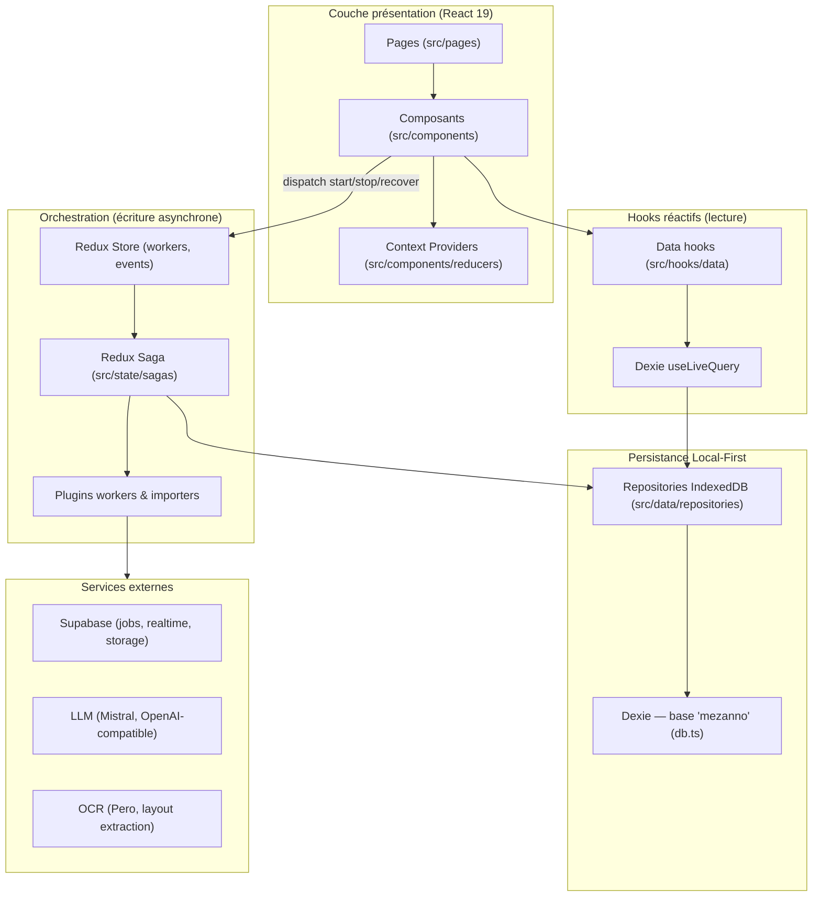

# Architecture — CorpuSense

_Spécification technique de référence. Dernière vérification contre le code : 2026-10-08. Les décisions sous-jacentes sont dans [DECISIONS.md](./DECISIONS.md)._

## 1. Rôle du projet

**CorpuSense** est une application web _Local-First_ d'ingénierie documentaire pour les humanités numériques : import de manifests [IIIF](https://iiif.io/) (URL, ARK Gallica, JSON collé, fichiers locaux), organisation de collections de canvas, annotation vectorielle de zones d'intérêt (W3C Web Annotation), traitements automatiques (OCR, extraction de layout, extraction structurée par LLM) et export de données (CSV, JSON, XLSX, Zip, W3C/IIIF).

Cas d'usage détaillés : [public/doc/usecase.md](../public/doc/usecase.md). Manuel utilisateur : [public/doc/howto.md](../public/doc/howto.md).

## 2. Stack technique

| Domaine         | Choix                                                                                                                      |
| --------------- | -------------------------------------------------------------------------------------------------------------------------- |
| UI              | React 19, TypeScript 5.9, Tailwind CSS 4, Radix UI / Shadcn UI, Lucide React                                               |
| Build           | Vite 7 (+ `vite-plugin-pwa`), Node 22+, npm 10+                                                                            |
| Persistance     | Dexie v4 (IndexedDB, base `mezanno`), réactivité via `dexie-react-hooks.useLiveQuery`                                      |
| Erreurs         | Result Pattern `FunctionResult<T, E>` (voir D-002)                                                                         |
| État asynchrone | Redux Toolkit (allégé, sans logger) + Redux-Saga ; TanStack React Query v5 ; Zustand v5                                    |
| Visualisation   | OpenSeaDragon, Annotorious 3 (`@annotorious/react`, `@annotorious/openseadragon`), dnd-kit                                 |
| IIIF            | `@iiif/presentation-3`, `@iiif/parser` (le serveur d'images Cantaloupe n'est référencé que dans `.env`, inutilisé en code) |
| PDF             | `@hyzyla/pdfium`, `pdfjs-dist`                                                                                             |
| Services        | Supabase (jobs `cs_jobs` via Realtime, Storage, Auth), Mistral AI, OpenAI-compatible, Pero OCR, EmailJS                    |
| Tests           | Vitest + Testing Library + `fake-indexeddb` ; ESLint 9 ; Prettier 3                                                        |

## 3. Architecture générale

CorpuSense suit un découpage strict en couches : l'UI ne parle jamais directement à la base, l'asynchrone lourd est orchestré par les sagas, et les traitements sont des plugins découverts dynamiquement.



Rôles :

1. **Bootstrap** (`src/main.tsx`, `src/App.tsx`) : initialise i18n, charge les plugins (`loadWorkerPlugins()`, `loadImporterPlugins()` via `import.meta.glob`, D-007), monte `BrowserRouter basename={VITE_BASE_PATH}` et la pile de providers.
2. **Lecture réactive** : les composants s'abonnent à IndexedDB via les hooks de `src/hooks/data/` (`useLiveCollections`, `useLiveSources`, `useAnnotationsForCanvas`…). Toute écriture en base rafraîchit l'IHM sans passage par Redux.
3. **Écriture et orchestration** : l'IHM dispatche des actions de commande (`startWorkerProcessRequest`, …) ; les sagas orchestrent, les plugins exécutent, les résultats sont persistés via les repositories ; Redux ne porte que le statut d'exécution et les notifications.
4. **Accès aux données** : jamais d'appel Dexie direct depuis l'UI — toujours un repository instancié par `dbFactory.ts` (D-004 ; interface de découplage non retenue, D-005).

## 4. Gestion de l'état (résumé de D-001)

| Mécanisme         | Emplacement                             | Contenu                                                                                        |
| ----------------- | --------------------------------------- | ---------------------------------------------------------------------------------------------- |
| IndexedDB (Dexie) | `src/data/repositories/indexeddb/db.ts` | Toute la donnée métier persistante                                                             |
| Redux Toolkit     | `src/state/store.ts`                    | Exactement deux slices : `workers` (statut d'exécution) et `events` (toasts) ; thunk désactivé |
| React Context     | `src/components/reducers/`              | Session utilisateur, sélection courante, contexte d'annotation, contexte worker…               |
| Zustand           | `src/state/zustand/useFSHandleStore.ts` | `FileSystemFileHandle` de la File System Access API                                            |
| React Query       | `src/hooks/`                            | Fetching externe ponctuel (conversion PDF, miniatures)                                         |
| localStorage      | navigateur                              | Clés API (Mistral, OpenAI, GitHub), drapeaux expérimentaux                                     |

## 5. Flux principaux

### Flux 1 — Lecture réactive (standard)

Composant → hook de `src/hooks/data/` → repository (via `dbFactory`) → `useLiveQuery` observe les tables Dexie → re-rendu automatique à toute écriture.

### Flux 2 — Commande et Result Pattern

Composant/saga → méthode de repository faillible → `FunctionResult<T, E>` typé (`{ ok, value } | { ok, error }`) ; erreurs `BaseError` avec contexte JSON ; incidents IO non récupérables = exceptions capturées **une seule fois** au boundary. Règles complètes : D-002.

### Flux 3 — Orchestration d'un worker (local ou distribué)

```text
Clic « Lancer worker » → dispatch startWorkerProcessRequest
→ saga workers.ts : garde de statut → plugin.run(task)
→ plugin (mistral, openai, mistralOcr, peroocr, layoutExtraction, customWorker)
   • local : Web Worker / calcul navigateur
   • distribué : insert dans Supabase cs_jobs → statuts POSTING/POSTED
     → passerelle useJobRealtime (Realtime + repli en sondage périodique 20 s)
→ résultat persisté via ResultRepository → statut worker dérivé de la file
→ toast via eventsReducer → vue réactive mise à jour par Dexie
```

Le statut des tâches (`WAITING, INPROGRESS, POSTING, POSTED, COMPLETED, ERROR…`) est aujourd'hui réparti entre quatre implémentations divergentes ; l'objectif est de le réunir dans un module pur unique (D-008, roadmap R1). Les anciens plugins `tesseract`/`surya` ne sont plus chargés (dossier `workers/old/`, suppression en roadmap Q5).

## 6. Plugins

- **Workers** (`src/state/sagas/plugins/workers/`, glob eager, filtre `experimental`) : `mistral.ts`, `openai.ts`, `mistralOcr.ts`, `peroocr.ts`, `layoutExtraction.ts`, `customWorker.ts`. Un plugin sait exécuter une tâche et exporter ses résultats.
- **Importers** (`importers/`) : `default.ts` (tout manifest IIIF v2/v3 par URL), `gallica.ts` (ARK BnF → manifest).
- Erreurs de plugin : sous-classes de `BaseError` nommant job/worker/URL (`plugins/errors.ts`).

## 7. Modèle de données

Vocabulaire du domaine : `CONTEXT.md` (racine). Schéma Dexie **version 31** (`db.ts`) :

| Store                                        | Clés/index                                                                     |
| -------------------------------------------- | ------------------------------------------------------------------------------ |
| `collections`                                | `&id, name, *tags.id`                                                          |
| `collectionContents`                         | `&id` (ordre = ordre du tableau `content`, v31)                                |
| `history`                                    | `&url`                                                                         |
| `storedManifests` / `storedManifestContents` | `&id, name` / `&id` (legacy, migration manuelle vers Sources)                  |
| `typesList`                                  | `&label`                                                                       |
| `itemMetadata`                               | `[id+attribute.label]`                                                         |
| `tags`                                       | `&id`                                                                          |
| `models`                                     | `&id, name`                                                                    |
| `annotations` / `annotationsTemp`            | `&id, canvasId, collectionId, [canvasId+collectionId], order, …`               |
| `namedEntities`                              | `&id, *annotationIds, type.id`                                                 |
| `results`                                    | `++id, workerName, workerId, [scopeKey+workerName], taskId, [workerId+taskId]` |
| `workers`                                    | `&id, name, status, [scopeKey+name]`                                           |
| `handles`                                    | `&id`                                                                          |
| `convertedFiles`                             | `&id, folderName`                                                              |
| `modifierChains`                             | `&id, name`                                                                    |
| `projects`                                   | `&id, name`                                                                    |
| `sources` / `sourceContents` / `storedBlobs` | `&id, name, type` / `&id` / `&id`                                              |

Conventions des modèles (`src/data/models/`) : séparation `*Details` (métadonnées légères) / `*Content` (payload lourd) ; `*CreateDTO` en entrée d'écriture ; schémas Zod (`z.infer`) pour les entités complexes ; annotations conformes au W3C Web Annotation Data Model (motivations `classifying` + `tagging`).

## 8. Routage

Routes déclarées dans `CorpusenseRoutes` (`src/hooks/useAppNavigation.tsx`) et montées dans `App.tsx` sous `Layout` :

| Chemin                       | Page                       | Rôle                                     |
| ---------------------------- | -------------------------- | ---------------------------------------- |
| `/`                          | `Home`                     | Accueil                                  |
| `/manifest`                  | `ManifestExplorerPage`     | Explorateur de manifests IIIF            |
| `/project`                   | `ProjectPage`              | Projets                                  |
| `/collections`               | `CollectionsManagerPage`   | Gestion des collections                  |
| `/collections/:collectionId` | `CollectionInspectorPage`  | Inspection, annotation, workers          |
| `/models`                    | `ModelsManagerPage`        | Éditeur de modèles de données            |
| `/modifier-chain`            | `ModifierChainManagerPage` | Chaînes de modificateurs                 |
| `/localSources`              | `StoragePage`              | Stockage local et sources importées      |
| `/iiifSources`               | `IIIFSourcesPage`          | Sources IIIF                             |
| `/workers`                   | `WorkersManagerPage`       | Suivi et configuration des workers       |
| `/configuration`             | `ConfigurationPage`        | Clés API et préférences                  |
| `/doc` `/doc/:page`          | `DocumentationPage`        | Visualiseur Markdown (lit `public/doc/`) |
| `/expert`                    | `ExpertPage`               | Mode expert                              |

L'application est mono-utilisateur locale : pas de garde de routes, décision documentée en D-011.

## 9. Configuration

Variables lues via `import.meta.env` (`src/utils/config.ts`) :

| Variable                                                                     | Rôle                                                                                    | Défaut    |
| ---------------------------------------------------------------------------- | --------------------------------------------------------------------------------------- | --------- |
| `VITE_BASE_PATH`                                                             | Sous-répertoire d'hébergement (router, assets, PWA)                                     | `/`       |
| `VITE_SUPABASE_URL` / `VITE_SUPABASE_ANON_KEY` / `VITE_SUPABASE_STORAGE_URL` | Instance Supabase (jobs, storage)                                                       | —         |
| `VITE_CANTALOUPE_URL`                                                        | Serveur d'images IIIF — présente dans `.env` mais jamais lue dans `src/` (candidate Q5) | optionnel |
| `VITE_EMAILJS_PUBLIC_KEY` / `_SERVICE_ID` / `_TEMPLATE_ID`                   | Formulaire de contact                                                                   | optionnel |
| `VITE_APP_VERSION` / `VITE_BUILD_DATE` / `VITE_GIT_HASH`                     | Injectées au build par `scripts/generate-env.js`                                        | —         |

Les clés API utilisateur (Mistral, OpenAI, GitHub PAT) ne passent **jamais** par `.env` : saisies dans la page de configuration, stockées en `localStorage` (D-011, registre S-04).

## 10. Build & déploiement

```text
npm run build → scripts/generate-env.js → tsc -b → vite build → dist/
push develop → .github/workflows/gh-pages.yml → GitHub Pages (branche gh-pages)
```

La PWA est générée par `vite-plugin-pwa`. `manualChunks` (vite.config.ts) isole les gros paquets (`@annotorious/*`, `@samvera/clover-iiif`). **Il n'existe pas de job CI de qualité** (lint/tests/tsc sur PR) — roadmap Q3.
